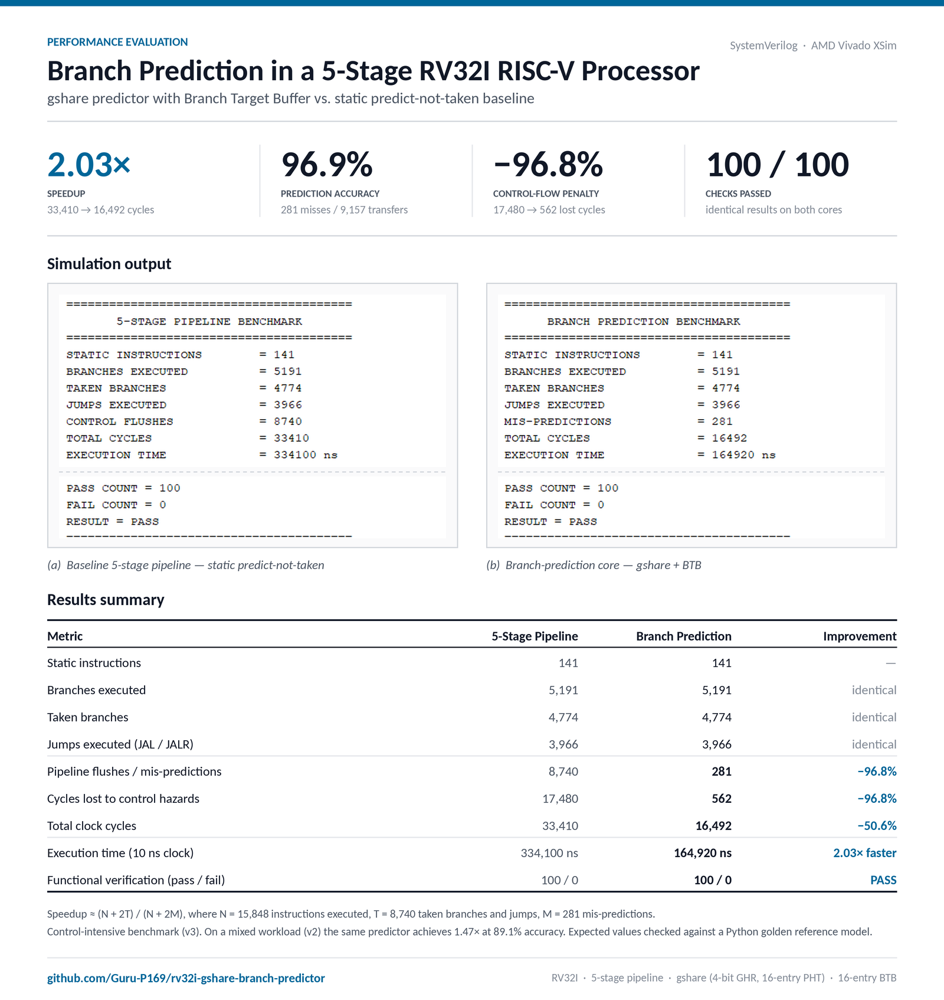
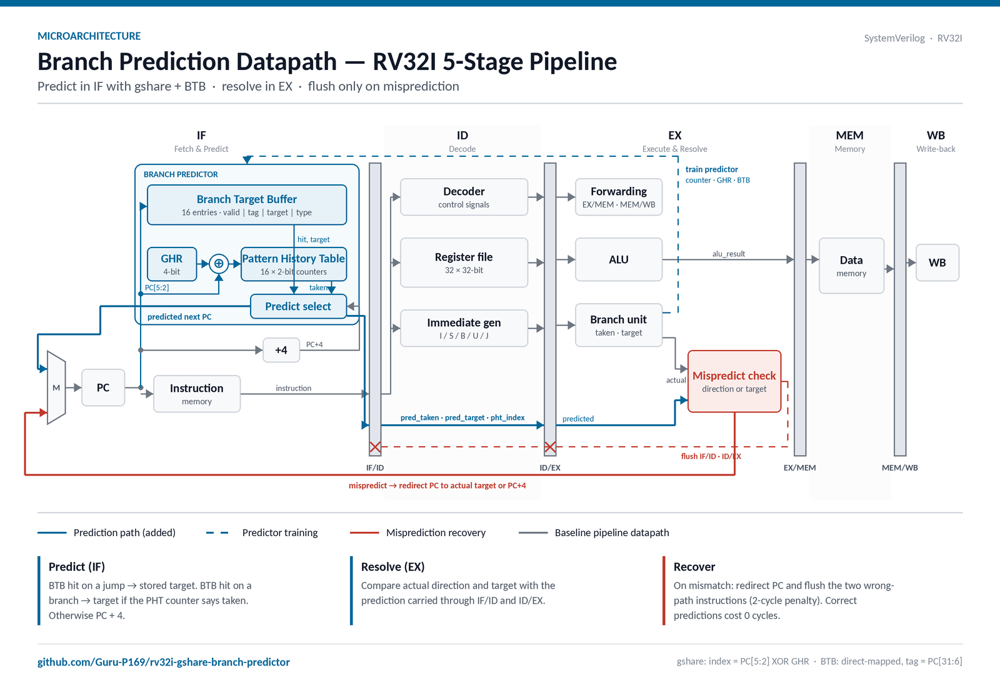
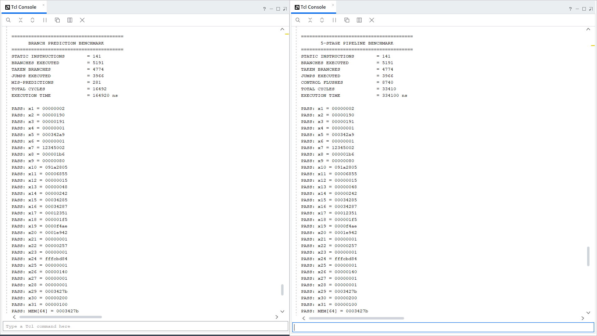
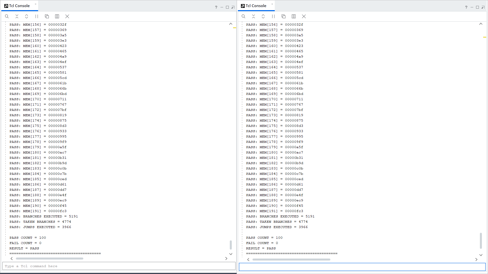
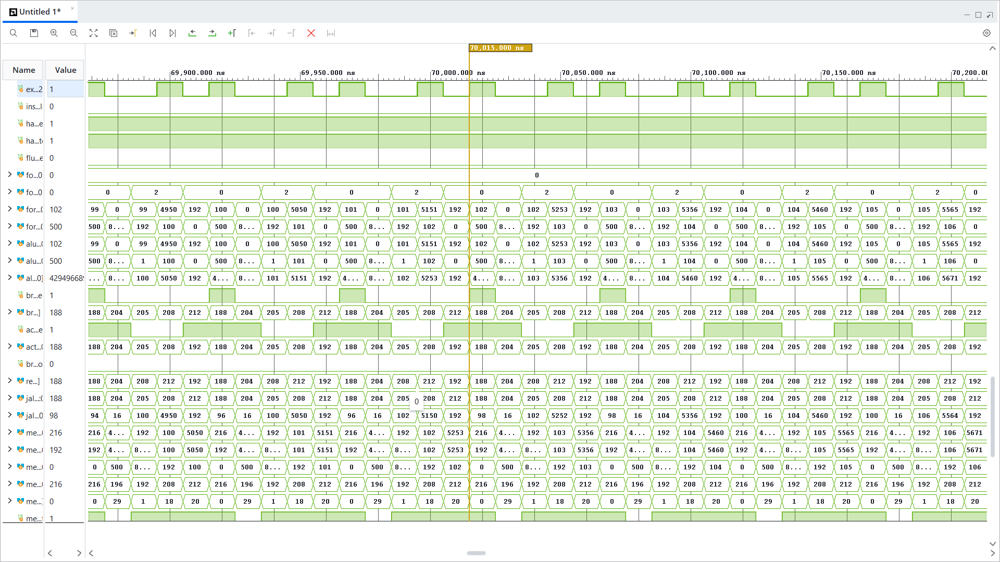
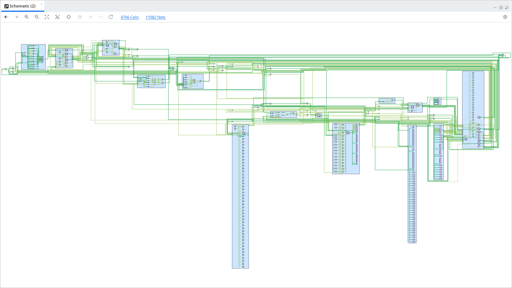

# RV32I 5-Stage RISC-V Core with gshare Branch Prediction


A **5-stage pipelined RV32I RISC-V processor** in **SystemVerilog**, extended with **dynamic branch prediction**: a **gshare direction predictor** and a **Branch Target Buffer (BTB)**. This project builds on my [RV32I 5-Stage Pipeline](https://github.com/Guru-P169/RV32I_RISC_V-5_STAGE_PIPELINE), which uses static predict-not-taken, and measures the performance gain with a self-checking benchmark that runs the **same program on both cores**.

---

## Results at a Glance



| Metric | 5-Stage Pipeline (baseline) | Branch Prediction (this repo) | Improvement |
|---|---:|---:|---:|
| Static instructions | 141 | 141 | — |
| Branches executed | 5,191 | 5,191 | identical |
| Taken branches | 4,774 | 4,774 | identical |
| Jumps executed (JAL / JALR) | 3,966 | 3,966 | identical |
| Pipeline flushes / mis-predictions | 8,740 | **281** | **−96.8%** |
| Cycles lost to control hazards | 17,480 | **562** | **−96.8%** |
| Total clock cycles | 33,410 | **16,492** | **−50.6%** |
| Execution time (10 ns clock) | 334,100 ns | **164,920 ns** | **2.03× faster** |
| Functional checks (pass / fail) | 100 / 0 | 100 / 0 | both PASS |

> Both cores run the same program and produce **identical** final register values, memory contents, and branch/jump counts. The predictor changes how fast the program runs, not what it computes.

---

## Project Overview

The baseline pipeline resolves branches in the **EX stage** and assumes every branch is not taken. Each taken branch or jump therefore flushes the two instructions already fetched, costing **2 clock cycles**.

This core predicts the next PC **in the IF stage** instead:

- **gshare** decides *whether* a conditional branch is taken.
- The **BTB** supplies *where* it goes, for branches, JAL, and JALR.
- The **EX stage** checks each prediction against the real outcome. Only mispredictions flush the pipeline.

### Key Highlights

- Full RV32I Base Integer ISA (R-type, I-type, Loads, Stores, Branches, LUI, AUIPC, JAL, JALR)
- Classic 5-Stage Pipeline (IF → ID → EX → MEM → WB)
- **gshare Branch Predictor**: 4-bit global history register, 16-entry table of 2-bit saturating counters
- **Branch Target Buffer**: 16-entry, direct-mapped, tagged, predicts targets for branches and jumps
- **Misprediction Recovery**: direction and target checked in EX, with selective flush of IF/ID and ID/EX
- EX/MEM and MEM/WB Data Forwarding
- Load-Use Hazard Detection with Automatic Stalling
- Self-checking benchmark testbench with live performance counters
- Expected results generated by a **Python golden reference model**

---

## Branch Prediction Architecture



### How a prediction works

| Stage | Action |
|---|---|
| **IF** | Index the BTB with `PC[5:2]` and the PHT with `PC[5:2] ⊕ GHR`. On a BTB hit: a **jump** goes to the stored target, and a **branch** goes to the target only if its counter says taken. Otherwise use `PC + 4`. |
| **IF → ID → EX** | The predicted direction, predicted target, and PHT index travel with the instruction through `IF/ID` and `ID/EX`. |
| **EX** | Compute the real outcome. A **misprediction** is a wrong direction, or taken with the wrong target. |
| **On mispredict** | Redirect the PC to the correct address (target or `PC + 4`) and flush `IF/ID` and `ID/EX`. |
| **Training** | Update the 2-bit counter and shift the outcome into the GHR for every branch. Write the target into the BTB for every branch and jump. |

### Predictor configuration

| Parameter | Value |
|---|---|
| Direction predictor | gshare |
| Global history register | 4 bits |
| Pattern history table | 16 entries, 2-bit saturating counters (reset: weakly not-taken) |
| BTB | 16 entries, direct-mapped, tag = `PC[31:6]` |
| BTB entry | valid, tag, target, branch/jump type |
| Prediction stage | IF |
| Resolution stage | EX |
| Mispredict penalty | 2 cycles |

---

## Repository Structure

```
rv32i-gshare-branch-predictor/
│
├── rtl/
│   ├── rv32i_core_g.sv                 # top level with prediction + recovery logic
│   ├── rv32i_gshare_predictor_g.sv     # gshare direction predictor (new)
│   ├── rv32i_btb_g.sv                  # branch target buffer (new)
│   ├── rv32i_pc_g.sv
│   ├── rv32i_instruction_memory_g.sv
│   ├── rv32i_decoder_g.sv
│   ├── rv32i_register_file_g.sv
│   ├── rv32i_imm_gen_g.sv
│   ├── rv32i_alu_g.sv
│   ├── rv32i_branch_unit_g.sv
│   ├── rv32i_forwarding_unit_g.sv
│   ├── rv32i_hazard_unit_g.sv
│   ├── rv32i_data_memory_g.sv
│   ├── rv32i_if_id_g.sv                # carries prediction info (modified)
│   ├── rv32i_id_ex_g.sv                # carries prediction info (modified)
│   ├── rv32i_ex_mem_g.sv
│   └── rv32i_mem_wb_g.sv
│
├── tb/
│   ├── rv32i_core_tb.sv                # self-checking benchmark testbench
│   └── instruction_memory.hex          # shared benchmark program
│
├── architecture/                       # branch predictor datapath diagram
├── results/                            # benchmark summary and Tcl console output
├── schematic/                          # Vivado RTL schematic
├── waveform/                           # simulation waveform
│
└── README.md
```

---

## RTL Modules

| Module | Description |
|---|---|
| `rv32i_core_g.sv` | Top level: pipeline stages, next-PC prediction, misprediction detection and recovery |
| `rv32i_gshare_predictor_g.sv` | **gshare** predictor: global history XOR PC indexes a table of 2-bit counters |
| `rv32i_btb_g.sv` | **Branch Target Buffer**: tagged target cache for branches, JAL and JALR |
| `rv32i_pc_g.sv` | Program counter |
| `rv32i_instruction_memory_g.sv` | Instruction memory |
| `rv32i_decoder_g.sv` | Instruction decode and control signal generation |
| `rv32i_register_file_g.sv` | 32 × 32-bit register file |
| `rv32i_imm_gen_g.sv` | Immediate generator (I/S/B/U/J formats) |
| `rv32i_alu_g.sv` | Arithmetic Logic Unit |
| `rv32i_branch_unit_g.sv` | Branch condition evaluation and target computation |
| `rv32i_forwarding_unit_g.sv` | EX/MEM and MEM/WB forwarding control |
| `rv32i_hazard_unit_g.sv` | Load-use hazard detection and stall control |
| `rv32i_data_memory_g.sv` | Data memory |
| `rv32i_if_id_g.sv` | IF/ID pipeline register, extended with prediction fields |
| `rv32i_id_ex_g.sv` | ID/EX pipeline register, extended with prediction fields |
| `rv32i_ex_mem_g.sv` | EX/MEM pipeline register |
| `rv32i_mem_wb_g.sv` | MEM/WB pipeline register |

---

## Hazard Handling

| Hazard Type | Cause | Baseline Pipeline | This Core |
|---|---|---|---|
| RAW (data) | ALU result needed before writeback | Forwarding, no stall | Forwarding, no stall |
| Load-Use | `lw` result needed by the next instruction | 1-cycle stall + bubble | 1-cycle stall + bubble |
| Control (predicted correctly) | Taken branch / JAL / JALR | Flush, 2 cycles | **No flush, 0 cycles** |
| Control (mispredicted) | Wrong direction or target | Flush, 2 cycles | Flush, 2 cycles |
| Structural | — | N/A (Harvard) | N/A (Harvard) |

---

## Benchmark and Verification

### Benchmark program

`tb/instruction_memory.hex` is a **141-instruction control-intensive benchmark**, shared by both cores. It exercises every RV32I control-flow instruction:

| Section | Pattern | Stresses |
|---|---|---|
| Tight loops | 2-instruction `addi` + `bne` / `blt` loops (1000 and 800 iterations) | Loop-branch prediction |
| Nested loops | 30 × 30 with a tight inner loop | History across loop exits |
| Array write / read | `sw` / `lw` loops with `bltu` / `bgeu` | Branches with load-use stalls |
| Function calls | 500 × `jal` → function → `jalr` return | BTB for calls and returns |
| Jump chain | 600 iterations, 3 `jal` per iteration | BTB for unconditional jumps |
| Pattern branch | taken 3 of every 4 iterations (400) | gshare history learning |
| Indirect jumps | 400 × `jal` + `jalr` + `bltu` | Indirect target prediction |
| Search and misc | early-exit `beq`, `lui`, `auipc`, forward branches | Correct flushing of skipped code |

### Self-checking testbench

`tb/rv32i_core_tb.sv`:

- Counts **branches, taken branches, jumps, mispredictions or flushes, and total cycles** live during simulation, sampled at the EX stage.
- Detects program end when `jal x0, 0` reaches EX, where it cannot be squashed.
- Checks all **31 registers**, **66 data-memory words**, and the **3 branch/jump counts** against a Python golden reference model.
- Prints a benchmark report and ends with `RESULT = PASS` or `RESULT = FAIL`.

### Performance analysis

The measured speedup matches a simple analytical model:

```
Speedup ≈ (N + 2T) / (N + 2M)

N = 15,848  instructions executed
T =  8,740  taken branches + jumps  (each costs 2 cycles in the baseline)
M =    281  mispredictions          (each costs 2 cycles with prediction)

(15,848 + 17,480) / (15,848 + 562) ≈ 2.03×
Prediction accuracy = 1 − 281 / 9,157 = 96.9%
```

| Workload | Taken transfers per instruction | Accuracy | Speedup |
|---|---:|---:|---:|
| Mixed (earlier version of the benchmark) | 0.29 | 89.1% | 1.47× |
| **Control-intensive (current)** | **0.55** | **96.9%** | **2.03×** |

> The speedup depends on how often a program branches. Typical code branches less often than this benchmark and would see a smaller but still significant gain.

---

## Simulation Results

### Benchmark Output: Baseline vs Branch Prediction





### Waveform: Function-Call Loop with Zero Mispredictions

The `jal` → `addi` → `add` → `jalr` → `bne` loop runs back to back with **no flushes and no mispredictions**. The running sum (1 + 2 + … + n) is visible on the ALU output.



### RTL Schematic



---

## How to Run (Vivado)

1. Create a Vivado project and add all `rtl/*.sv` files as **design sources**.
2. Add `tb/rv32i_core_tb.sv` and `tb/instruction_memory.hex` as **simulation sources**.
3. Set the simulation run time to run until completion:
   ```tcl
   set_property -name {xsim.simulate.runtime} -value {-all} -objects [get_filesets sim_1]
   ```
4. Run **Behavioral Simulation**. The benchmark report appears in the Tcl console.

To compare against the baseline, run the same `instruction_memory.hex` on the [RV32I 5-Stage Pipeline](https://github.com/Guru-P169/RV32I_RISC_V-5_STAGE_PIPELINE).

---

## Concepts Covered

- Pipelined Processor Design
- RISC-V Instruction Set Architecture
- Control Hazards and the Cost of Pipeline Flushing
- Dynamic Branch Prediction (2-bit saturating counters)
- Global History and gshare Indexing
- Branch Target Buffers and Target Prediction
- Speculative Execution and Misprediction Recovery
- Data Forwarding and Load-Use Stalling
- Benchmark-Driven Performance Evaluation
- Golden-Model-Based Self-Checking Verification

---

## Tools & Technologies

- **SystemVerilog**
- **AMD Vivado Simulator (XSim)**
- **Python** (golden reference model and benchmark generator)
- **Visual Studio Code**
- **Git** and **GitHub**

---

## Future Enhancements

- Larger predictor tables (8-bit history, 64-entry BTB) to reduce aliasing
- Return Address Stack (RAS) for function returns
- Tournament predictor (local + global)
- Branch resolution in the ID stage to reduce the mispredict penalty
- CSR, ECALL / EBREAK, exceptions and interrupts
- SystemVerilog Assertions (SVA) and functional coverage
- FPGA implementation with timing and area comparison

---

## Related Project

- [RV32I 5-Stage Pipeline](https://github.com/Guru-P169/RV32I_RISC_V-5_STAGE_PIPELINE): the baseline core this design extends

---

## Author

**Guru P**

Electronics and Communication Engineering Student

### Areas of Interest

- RTL Design
- Computer Architecture
- ASIC Design
- Functional Verification
- VLSI Frontend Design

GitHub: **https://github.com/Guru-P169**

---

⭐ If you found this project useful or interesting, consider giving it a star on GitHub.
